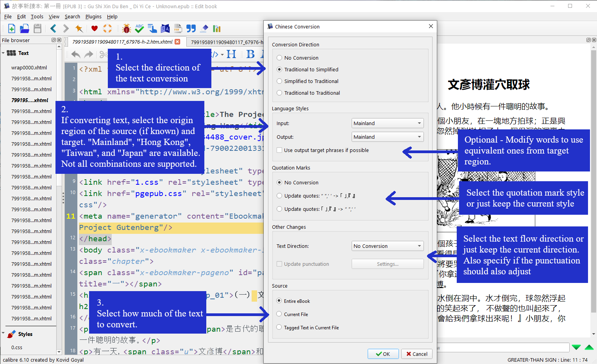
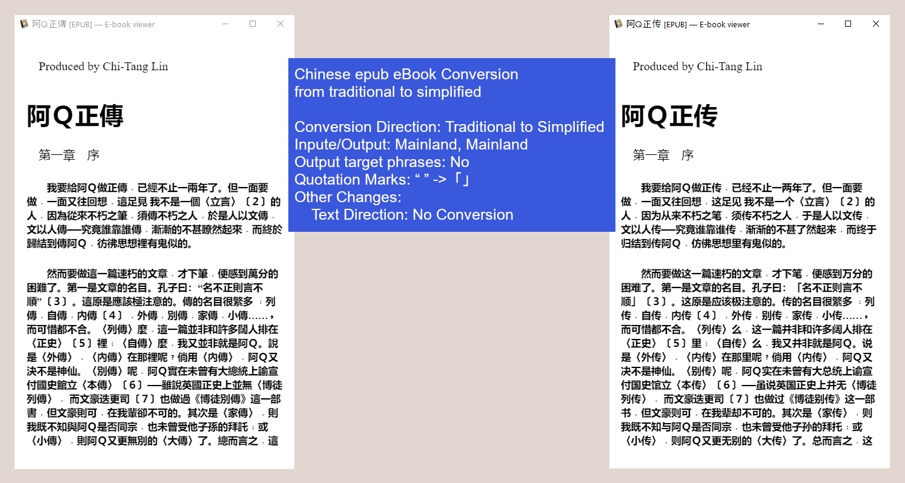
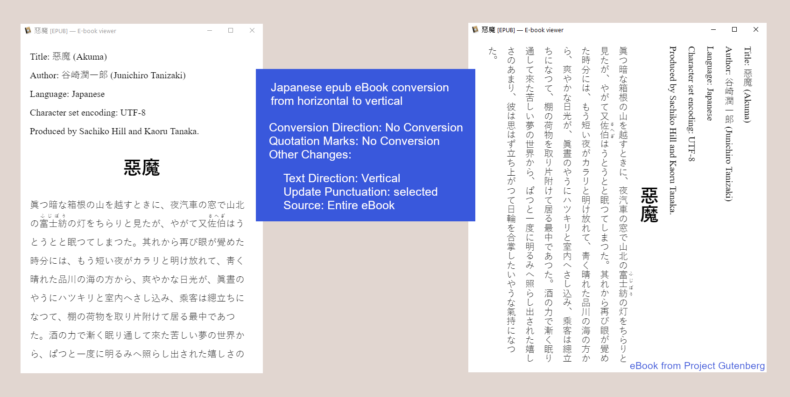

Chinese (and Japanese) Text Conversion (A Calibre ebook editor plugin)
============

Currently, the Chinese language is written with two different standardized character sets. The Chinese mainland and Singapore officially use the simplified set while other areas (such as Taiwan and Hong Kong) continue to largely use the traditional set. This Calibre ebook editor plugin will allow users to convert between both formats.

It also can make changes to quotation mark formats and text flow direction. This
useful when dealing with Japanese ebooks.

**Main Features** 

1) Convert eBooks written in traditional characters into simplified characters

2) Convert eBooks written in simplified characters into traditional characters

3) Convert regional words and idioms used in the source material to those words and idioms used in the destination material

4) Convert text direction

5) Convert individual sections or the entire book

6) Update metadata and table of contents

7) Provides command line processing for batch operations

7) This is an editor plugin so users can make changes in case the conversion is not perfect

**Notes** 

1) This plugin incorporates python code from opencc-python (https://github.com/yichen0831/opencc-python). License: Apache License 2.0

2) This plugin uses data from OpenCC (https://github.com/BYVoid/OpenCC). License: Apache License 2.0

3) Python Software Foundation code (GPL Compatible)

4) The plugin also uses python code from DiapDealer's Editing Toolbag (https://github.com/dougmassay/toolbag-calibre-plugin). Licenese: GPL3

Support Link
=====

* Plugin support thread on MobileRead: <https://www.mobileread.com/forums/showthread.php?t=275572>

Building
========
No building necessary other than wrapping the entire directory in a zip file. The "img" directory is not needed.

Contributing / Modifying
============
Feel free to submit issues and pull requests or even fork the repository.

See an introduction to creating calibre plugins is available at
<https://manual.calibre-ebook.com/creating_plugins.html>.

License Information
=======

###Chinese Text Conversion (A calibre editor plugin)

    Overall code licensed under the GPLv3.
	Images in images directory are open source
	Text and JSON files in dictionary and config directories are from OpenCC under Apache License 2.0

